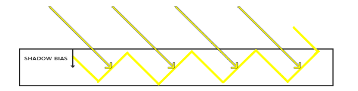

# 阴影映射

原文     | [Shadow Mapping](http://learnopengl.com/#!Advanced-Lighting/Shadows/Shadow-Mapping)
      ---|---
作者     | JoeyDeVries
翻译     | [Django](http://bullteacher.com/)
校对     | gjy_1992, [1i9h7_b1u3](https://github.com/1012796366/)

阴影是由于遮挡导致光线无法到达而形成的。当一个光源的光线因为被其他物体阻挡而无法照射到某个物体时，该物体便处于阴影之中。阴影为光照场景增添了极强的真实感，让观察者能够更容易感知物体之间的空间关系。为场景赋予了更强的立体感。例如，观察下方两张图，一张有阴影而另外一张没有阴影：


你可以看到，有阴影的时候你能更容易地区分出物体之间的位置关系，例如，只有在有阴影的情况下，我们才能明显看到其中一个立方体悬浮于其他立方体之上。

然而，实现阴影绝非易事，主要是因为目前的实时（光栅化图形）研究领域并没有开发出完美的阴影算法，虽然已经有许多优秀的阴影近似算法，但它们都有无法忽略的瑕疵。

大多数电子游戏中使用的一种技术是<def>阴影映射</def>(shadow mapping)，效果不错，而且相对容易实现。阴影映射并不难以理解，性能开销不算太高，而且非常容易扩展成更高级的算法（比如[全向阴影贴图](02 Point Shadows.md)和[级联阴影贴图](../../08 Guest Articles/2021/01 CSM.md)）。

## 阴影映射

阴影映射背后的思路非常简单：我们以光的位置为视角进行渲染，我们能看到的东西都将被点亮，看不见的一定是在阴影之中了。假设有一个地板，在光源和它之间有一个大盒子。由于从光源处向光线方向看去，可以看到这个盒子，但看不到地板的一部分，这部分就应该在阴影中了。


这里的所有蓝线代表光源可以看到的片段。黑线代表被遮挡的片段：它们会被渲染为处于阴影中的片段。如果我们绘制一条从光源出发，到达最右边盒子上的一个片段上的线段或<def>射线</def>(ray)，那么射线将先击中悬浮的盒子，随后才会到达最右侧的盒子。结果就是悬浮的盒子被照亮，而最右侧的盒子将处于阴影之中。

我们希望得到射线首次击中物体时的交点，然后用这个最近的点和射线上其他点进行对比。随后我们将测试一下，如果一个测试点比最近点更远的话，那么这个点就在阴影中。然而，若从这类光源发射出成千上万条光线并逐一遍历，是一种极为低效的方法，实时渲染上基本不可取。不过，我们可以采取相似举措，不用投射出光的射线，而是使用我们非常熟悉的东西：深度缓冲。

你可能记得在[深度测试](../../04 Advanced OpenGL/01 Depth testing.md)教程中，在深度缓冲里的一个值对应于片段在摄像机视角下的深度值，其范围在0到1之间。如果我们从光源的视角来渲染场景，并把生成的深度值储存到纹理中会怎样？通过这种方式，我们就能从光源的视角采样最近的深度值。最终便可获得该方向上第一个可见片段的深度值。我们将所有的深度值存储到一个纹理中，称之为<def>深度贴图</def>(depth map)或是<def>阴影贴图</def>(shadow map)。


左侧的图片展示了一个定向光源（所有光线都是平行的）在立方体下的表面投射的阴影。通过储存到深度贴图中的深度值，我们就能找到最近点，用来确定片段是否在阴影中。我们使用该光源的视图矩阵和投影矩阵，从光源的角度下渲染场景，从而生成深度贴图。这个投影矩阵和视图矩阵一同形成了一个变换矩阵\(T\)，它可以将任何三维位置转变到光源的可见坐标空间。

!!! Important

    因为定向光源被设定为无限远，所以它没有具体的位置。然而，为了实现阴影映射，我们得从光源的某个虚拟位置，沿着定向光源方向来渲染场景。

我们可以看到，在右边的图中，平行光和观察者位置都与左图相同。我们渲染一个在点\(\bar{\color{red}{P}}\)处的片段，需要确定它是否在阴影中。我们得先使用变换矩阵\(T\)把点\(\bar{\color{red}{P}}\)变换到光源的坐标空间里。既然现在是从光的角度来看点\(\bar{\color{red}{P}}\)的，那么该点的z坐标就相当于它的深度值，本例中这个值是0.9。 通过点\(\bar{\color{red}{P}}\)的坐标，我们可以采样深度/阴影贴图，获得从光源视角中可见的最近深度值，结果是点\(\bar{\color{green}{C}}\)，本例中，最近的深度值是0.4。因为采样深度贴图的结果是一个小于点\(\bar{\color{red}{P}}\)的深度值，我们可以断定\(\bar{\color{red}{P}}\)被挡住了，它在阴影中了。

因此，阴影映射由两个步骤组成：首先，我们渲染深度贴图，然后我们像往常一样渲染场景，使用生成的深度贴图来计算片段是否在阴影之中。听起来有点复杂，但随着我们一步一步地讲解这个技术，就能理解了。

## 深度贴图

第一步我们需要生成一张深度贴图(<def>Depth Map</def>)。深度贴图是从光的透视图里渲染的深度纹理，用它计算阴影。因为我们需要将场景的渲染结果储存到一个纹理中，我们将再次需要帧缓冲。

首先，我们要为渲染的深度贴图创建一个帧缓冲对象：

```c++
unsigned int depthMapFBO;
glGenFramebuffers(1, &depthMapFBO);
```

然后，创建一个2D纹理，提供给帧缓冲的深度缓冲使用：

```c++
const unsigned int SHADOW_WIDTH = 1024, SHADOW_HEIGHT = 1024;

unsigned int depthMap;
glGenTextures(1, &depthMap);
glBindTexture(GL_TEXTURE_2D, depthMap);
glTexImage2D(GL_TEXTURE_2D, 0, GL_DEPTH_COMPONENT, 
             SHADOW_WIDTH, SHADOW_HEIGHT, 0, GL_DEPTH_COMPONENT, GL_FLOAT, NULL);
glTexParameteri(GL_TEXTURE_2D, GL_TEXTURE_MIN_FILTER, GL_NEAREST);
glTexParameteri(GL_TEXTURE_2D, GL_TEXTURE_MAG_FILTER, GL_NEAREST);
glTexParameteri(GL_TEXTURE_2D, GL_TEXTURE_WRAP_S, GL_REPEAT); 
glTexParameteri(GL_TEXTURE_2D, GL_TEXTURE_WRAP_T, GL_REPEAT);  
```

生成深度贴图不太复杂。因为我们只关心深度值，我们要把纹理格式指定为GL_DEPTH_COMPONENT。我们还要把纹理的高宽设置为1024：这是深度贴图的分辨率。

把我们把生成的深度纹理作为帧缓冲的深度缓冲：

```c++
glBindFramebuffer(GL_FRAMEBUFFER, depthMapFBO);
glFramebufferTexture2D(GL_FRAMEBUFFER, GL_DEPTH_ATTACHMENT, GL_TEXTURE_2D, depthMap, 0);
glDrawBuffer(GL_NONE);
glReadBuffer(GL_NONE);
glBindFramebuffer(GL_FRAMEBUFFER, 0);
```

我们只需要从光源角度渲染场景时的深度信息，因此不需要使用颜色缓冲。然而，不包含颜色缓冲的帧缓冲对象是不完整的，所以我们需要显式告诉OpenGL我们不会渲染任何颜色数据。我们用glDrawBuffer和glReadBuffer来把读和绘制缓冲设置为GL_NONE。

合理配置将深度值渲染到纹理的帧缓冲后，我们就可以开始第一步了：生成深度贴图。两个步骤的完整的渲染阶段，看起来有点像这样：

```c++
// 1. 首选渲染深度贴图
glViewport(0, 0, SHADOW_WIDTH, SHADOW_HEIGHT);
glBindFramebuffer(GL_FRAMEBUFFER, depthMapFBO);
    glClear(GL_DEPTH_BUFFER_BIT);
    ConfigureShaderAndMatrices();
    RenderScene();
glBindFramebuffer(GL_FRAMEBUFFER, 0);
// 2. 像往常一样渲染场景，但这次使用深度贴图
glViewport(0, 0, SCR_WIDTH, SCR_HEIGHT);
glClear(GL_COLOR_BUFFER_BIT | GL_DEPTH_BUFFER_BIT);
ConfigureShaderAndMatrices();
glBindTexture(GL_TEXTURE_2D, depthMap);
RenderScene();
```

这段代码隐去了一些细节，但它表达了阴影映射的基本思路。这里一定要记得调用glViewport。因为阴影贴图经常和我们原来渲染的场景（通常是窗口分辨率）有着不同的分辨率，我们需要改变视口(<def>viewport</def>)的参数以适应阴影贴图的尺寸。如果我们忘了更新视口参数，最后的深度贴图要么太小要么就不完整。

### 光源空间的变换

前面那段代码中一个不清楚的函数是`ConfigureShaderAndMatrices`。在第二个步骤中，这和往常一样：确保投影矩阵和视图矩阵都已经正确设置，并且为每个物体设置相应的模型矩阵。然而，在第一个步骤中，我们需要使用不同的投影矩阵和视图矩阵来从光源角度渲染场景。

因为我们使用的是一个所有光线都平行的定向光。出于这个原因，我们将为光源使用正交投影矩阵，透视图将没有任何变形：

```c++
float near_plane = 1.0f, far_plane = 7.5f;
glm::mat4 lightProjection = glm::ortho(-10.0f, 10.0f, -10.0f, 10.0f, near_plane, far_plane);
```

上面的代码是本章演示场景中所使用的正交投影矩阵的示例。因为该投影矩阵间接决定可视区域的范围（例如哪些东西不会被裁切），所以你需要确保投影视锥的尺寸包括了应当出现在深度贴图里面的所有物体。当物体或者片段没有出现在深度贴图中的时候，它们就不会产生阴影。

为了创建一个视图矩阵来变换每个物体，把它们变换到从光源视角可见的空间中，我们将使用glm::lookAt函数；这次从光源的位置看向场景中央。

```c++
glm::mat4 lightView = glm::lookAt(glm::vec3(-2.0f, 4.0f, -1.0f), 
                                  glm::vec3( 0.0f, 0.0f,  0.0f), 
                                  glm::vec3( 0.0f, 1.0f,  0.0f));  
```

二者相结合为我们提供了一个光源空间的变换矩阵，它将每个世界空间向量变换到在光源位置可以看到的的空间；这正是我们渲染深度贴图所需要的。

```c++
glm::mat4 lightSpaceMatrix = lightProjection * lightView;
```

这个`lightSpaceMatrix`正是前面我们称为\(T\)的那个变换矩阵。有了`lightSpaceMatrix`，只要给每个着色器提供光源空间的投影矩阵和视图矩阵，我们就能像往常那样渲染场景了。然而，我们只关心深度值，并不执行复杂的（照明）片段计算。为了提升性能，我们将使用一个与之不同但更为简单的着色器来渲染出深度贴图。

### 渲染至深度贴图

当我们从光的角度来渲染场景的时候，我们会用一个比较简单的着色器，这个着色器只会把顶点变换到光空间。这个简单的着色器叫做`simpleDepthShader`，就是使用下面的这个着色器：

```c++
#version 330 core
layout (location = 0) in vec3 aPos;

uniform mat4 lightSpaceMatrix;
uniform mat4 model;

void main()
{
    gl_Position = lightSpaceMatrix * model * vec4(aPos, 1.0);
}  
```

这个顶点着色器接收模型矩阵和顶点数据，使用`lightSpaceMatrix`变换到光源空间中。

由于我们没有颜色缓冲并且禁止了读取和绘制缓冲，因此生成的片段不需要进行任何处理，所以我们可以简单地使用一个空片段着色器：

```c++
#version 330 core
 
void main()
{             
    // gl_FragDepth = gl_FragCoord.z;
}
```

这个空片段着色器什么也不干，运行完后，深度缓冲会被更新。我们可以取消片段着色器中那一行的注释，来显式设置深度，但因为底层总会去设置深度缓冲，所以我们没必要显式设置，直接使用空的片段着色器即可。

现在，渲染深度/阴影贴图的过程如下所示：

```c++
simpleDepthShader.use();
glUniformMatrix4fv(lightSpaceMatrixLocation, 1, GL_FALSE, glm::value_ptr(lightSpaceMatrix));

glViewport(0, 0, SHADOW_WIDTH, SHADOW_HEIGHT);
glBindFramebuffer(GL_FRAMEBUFFER, depthMapFBO);
    glClear(GL_DEPTH_BUFFER_BIT);
    RenderScene(simpleDepthShader);
glBindFramebuffer(GL_FRAMEBUFFER, 0);  
```

这里的`RenderScene`函数接受着色器程序(<def>shader program</def>)作为参数，它调用所有相关的绘制函数，并在需要的地方设置相应的模型矩阵。

最终的成品是一个填充完整的深度缓冲区，其中存储了从光源视角可见的所有片段的最近深度值。通过将这个纹理渲染到一个2D四边形上（和我们在帧缓冲一节做的后期处理过程类似），就能在屏幕上显示出来下面的效果：


我们使用下面的片段着色器来将深度贴图渲染到四边形上：

```c++
#version 330 core
out vec4 FragColor;
  
in vec2 TexCoords;

uniform sampler2D depthMap;

void main()
{             
    float depthValue = texture(depthMap, TexCoords).r;
    FragColor = vec4(vec3(depthValue), 1.0);
}  
```

要注意的是当用透视投影矩阵而不是正交投影矩阵来显示深度时，存在一些细微的差异，因为使用透视投影时，深度是非线性的。本节教程的最后，我们会讨论这些不同之处。

你可以在[这里](https://learnopengl.com/code_viewer_gh.php?code=src/5.advanced_lighting/3.1.1.shadow_mapping_depth/shadow_mapping_depth.cpp)获得把场景渲染成深度贴图的源码。

## 渲染阴影

正确地生成深度贴图以后我们就可以开始生成阴影了。这段代码在片段着色器中执行，用来检验一个片段是否在阴影之中，不过我们在顶点着色器中进行光源空间的变换：

```c++
#version 330 core
layout (location = 0) in vec3 aPos;
layout (location = 1) in vec3 aNormal;
layout (location = 2) in vec2 aTexCoords;

out VS_OUT {
    vec3 FragPos;
    vec3 Normal;
    vec2 TexCoords;
    vec4 FragPosLightSpace;
} vs_out;

uniform mat4 projection;
uniform mat4 view;
uniform mat4 model;
uniform mat4 lightSpaceMatrix;

void main()
{    
    vs_out.FragPos = vec3(model * vec4(aPos, 1.0));
    vs_out.Normal = transpose(inverse(mat3(model))) * aNormal;
    vs_out.TexCoords = aTexCoords;
    vs_out.FragPosLightSpace = lightSpaceMatrix * vec4(vs_out.FragPos, 1.0);
    gl_Position = projection * view * vec4(vs_out.FragPos, 1.0);
}
``` 

这段代码里的新内容是`FragPosLightSpace`这个输出向量。我们用和之前一样的`lightSpaceMatrix`（即生成深度贴图时，用于将世界空间中的顶点坐标变换到光源空间的矩阵），把世界空间中的顶点位置转换到光源空间，方便之后在片段着色器中使用。

我们用来渲染场景的主片段着色器使用了<def>Blinn-Phong</def>光照模型。在片段着色器中，我们计算阴影分量，当片段处于阴影中时，其值为1.0，当片段不在阴影中时，其值为0.0，然后将得到的漫反射分量和镜面分量乘以这个阴影分量。因为光散射的缘故，阴影很少是完全黑暗的，所以我们并没有让环境分量乘以阴影分量。

```c++
#version 330 core
out vec4 FragColor;

in VS_OUT {
    vec3 FragPos;
    vec3 Normal;
    vec2 TexCoords;
    vec4 FragPosLightSpace;
} fs_in;

uniform sampler2D diffuseTexture;
uniform sampler2D shadowMap;

uniform vec3 lightPos;
uniform vec3 viewPos;

float ShadowCalculation(vec4 fragPosLightSpace)
{
    [...]
}

void main()
{           
    vec3 color = texture(diffuseTexture, fs_in.TexCoords).rgb;
    vec3 normal = normalize(fs_in.Normal);
    vec3 lightColor = vec3(1.0);
    // 环境光
    vec3 ambient = 0.15 * lightColor;
    // 漫反射
    vec3 lightDir = normalize(lightPos - fs_in.FragPos);
    float diff = max(dot(lightDir, normal), 0.0);
    vec3 diffuse = diff * lightColor;
    // 镜面高光
    vec3 viewDir = normalize(viewPos - fs_in.FragPos);
    float spec = 0.0;
    vec3 halfwayDir = normalize(lightDir + viewDir);  
    spec = pow(max(dot(normal, halfwayDir), 0.0), 64.0);
    vec3 specular = spec * lightColor;    
    // 计算阴影值
    float shadow = ShadowCalculation(fs_in.FragPosLightSpace);       
    vec3 lighting = (ambient + (1.0 - shadow) * (diffuse + specular)) * color;    
    
    FragColor = vec4(lighting, 1.0);
}
```

片段着色器大部分是从[高级光照](../01 Advanced Lighting.md/)教程中复制过来的，只不过加上了个阴影计算。我们声明一个`shadowCalculation`函数，用它计算阴影。片段着色器的最后，我们我们把漫反射分量和镜面分量乘以阴影分量的反值（1.0-`shadow`），这表示该片段有不受阴影遮挡的程度。这个片段着色器还需要两个额外输入，一个是变换到光源空间后的片段位置，另一个是第一个渲染阶段得到的深度贴图。

要检查一个片段是否在阴影中，首先要把光源空间片段位置转换为裁切空间的标准化设备坐标。当我们在顶点着色器输出一个裁切空间顶点位置到`gl_Position`时，OpenGL自动进行一个透视除法，例如，将裁切空间坐标的范围[-w,w]转为[-1,1]，这要将x、y、z分量除以向量的w分量来实现。由于裁切空间的`FragPosLightSpace`并不会通过`gl_Position`传到片段着色器里，我们必须自己做透视除法：

```c++
float ShadowCalculation(vec4 fragPosLightSpace)
{
    // 执行透视除法
    vec3 projCoords = fragPosLightSpace.xyz / fragPosLightSpace.w;
    [...]
}
```

这将返回片段在光源空间中的位置，并将范围限定在[-1,1]。

!!! Important

    当使用正交投影矩阵时，向量的w分量仍保持不变，所以这一步实际上毫无意义。可是，当使用透视投影的时候，这一步又变得不可或缺。所以为了保证在两种投影矩阵下都能正常运作，就得留着这行。

因为来自深度贴图的深度范围是[0,1]，我们也打算使用`projCoords`从深度贴图中去采样，所以我们将NDC坐标范围变换为[0,1]。

```c++
projCoords = projCoords * 0.5 + 0.5;
```

!!! note "译注"
    
    这里的意思是，上面的projCoords的xyz分量都是[-1,1]（下面会指出这对于远平面之类的点才成立），而为了和深度贴图的深度相比较，z分量需要变换到[0,1]；为了作为从深度贴图中采样的坐标，xy分量也需要变换到[0,1]。所以整个projCoords向量都需要变换到[0,1]范围。

通过此变换，投影坐标projCoords的[0,1]范围坐标将与第一个渲染阶段生成的NDC坐标精确对应。这样我们就能从深度贴图中获取光源视角下的最近深度值：

```c++
float closestDepth = texture(shadowMap, projCoords.xy).r;
```

为了得到片段的当前深度，我们简单获取投影向量的z坐标，它等于来自光的透视视角的片段的深度。

```c++
float currentDepth = projCoords.z;
```

实际的对比就是简单检查currentDepth是否高于closetDepth，如果是，那么片段就在阴影中。

```c++
float shadow = currentDepth > closestDepth  ? 1.0 : 0.0;
```

完整的`shadowCalculation`函数是这样的：

```c++
float ShadowCalculation(vec4 fragPosLightSpace)
{
    // 执行透视除法
    vec3 projCoords = fragPosLightSpace.xyz / fragPosLightSpace.w;
    // 变换到[0,1]的范围
    projCoords = projCoords * 0.5 + 0.5;
    // 取得最近点的深度(使用[0,1]范围下的fragPosLight当坐标)
    float closestDepth = texture(shadowMap, projCoords.xy).r; 
    // 取得当前片段在光源视角下的深度
    float currentDepth = projCoords.z;
    // 检查当前片段是否在阴影中
    float shadow = currentDepth > closestDepth  ? 1.0 : 0.0;
 
    return shadow;
}
```

激活这个着色器，绑定合适的纹理，激活第二个渲染阶段默认的投影矩阵以及视图矩阵，结果如下图所示：


如果你做对了，你会看到地板和上有立方体的阴影（尽管还是有不少瑕疵）。你可以从[这里](https://learnopengl.com/code_viewer_gh.php?code=src/5.advanced_lighting/3.1.2.shadow_mapping_base/shadow_mapping_base.cpp)找到demo程序的源码。

## 改进阴影映射

我们成功地让阴影映射工作起来了，但是你也看到了，由于若干（清晰可见的）与阴影映射相关的瑕疵，目前的效果还是不够完善，我们得做些修复，接下来的章节中我们将着重解决这些问题。

### 阴影失真

前面的图片中明显有不对的地方。放大看会发现明显的摩尔纹：


我们可以看到地板四边形渲染出很大一块交替黑线。这种阴影的不真实感叫做<def>阴影失真</def>(Shadow Acne)，下图解释了成因：


受阴影贴图的分辨率影响，当多个片段距离光源比较远的时候，它们可能从深度贴图中采样相同的深度值。图片中，每个斜坡代表深度贴图一个单独的纹理像素。你可以看到，多个片段会采样相同的深度值。

虽然很多时候没问题，但是当光源以某个角度照射表面的时候就会出问题，这种情况下深度贴图也是从这样的角度下进行渲染的，随后，多个片段就会从同一个斜坡的深度纹理像素中采样，其中一部分在地板上面，另一部分在地板下面；这样我们所得到的阴影就有了差异。也因此，一部分片段位于阴影中，而一部分则不是，最终产生了图片中的条纹样式。

我们可以用一个叫做<def>阴影偏移</def>（shadow bias）的技巧来解决这个问题，我们简单的对表面的深度（或深度贴图）应用一个偏移量，这样片段就不会被错误地认为在表面之下了。



使用了偏移量后，所有采样点都获得了比表面深度更小的深度值，这样整个表面就正确地被照亮，没有任何阴影。我们可以这样实现这个偏移：

```c++
float bias = 0.005;
float shadow = currentDepth - bias > closestDepth  ? 1.0 : 0.0;
```

一个0.005的偏移就能帮到很大的忙，但偏移值高度依赖于光源与表面的夹角，如果倾角特别大的话，那么阴影仍然还是会失真。更稳健的办法是根据表面朝向光线的角度来更改偏移量，使用点乘就可以实现这个办法：

```c++
float bias = max(0.05 * (1.0 - dot(normal, lightDir)), 0.005);
```

这里我们有一个偏移量的最大值0.05，和一个最小值0.005，它们是基于表面法线和光照方向的。这样像地板这样的表面几乎与光源垂直，得到的偏移就很小，而比如立方体的侧面这种表面得到的偏移就更大。下图展示了使用了阴影偏移后的同一个场景，可以看出效果的确更好：


因为各个场景中合适的偏差值都不尽相同，所以可能需要经过一番调整后才能找到合适的偏移值，但大多情况下，实际上就是增加偏移量直到所有失真都被移除的问题。

### 阴影悬浮

使用阴影偏移的一个缺点是你对物体的实际深度应用了平移。偏移值足够大时，会导致阴影明显地偏离了实际物体，你可以从下图看到这个现象（这是一个夸张的偏移值）：


这个阴影失真叫做<def>阴影悬浮</def>(Peter Panning)，因为物体看起来轻轻悬浮在表面之上。

!!! note "译注"
    
    Peter Pan就是长篇小说《彼得·潘》中的人物，panning有平移、悬浮之意，而且彼得潘恰好是个会飞的男孩。

我们可以使用一个叫技巧解决大部分的阴影悬浮问题：当渲染深度贴图时候使用<def>正面剔除</def>(front face culling)。你也许记得在[面剔除](../../04 Advanced OpenGL/04 Face culling.md)教程中OpenGL默认是背面剔除。而现在我们要告诉OpenGL，在渲染阴影贴图时要剔除正面。

因为我们只需要深度贴图的深度值，对于实心物体来说，无论我们用它们的正面还是背面都没问题。使用背面深度不会有错误，即使阴影在物体内部有错误，我们也看不见。


为了修复阴影悬浮，在阴影贴图生成阶段，我们要进行正面剔除，首先必须开启GL_CULL_FACE：

```c++
glCullFace(GL_FRONT);
RenderSceneToDepthMap();
glCullFace(GL_BACK); // 不要忘记设回原先的面剔除
```

这十分有效地解决了阴影悬浮的问题，但只适用于具有封闭内部空间的实心物体。在我们的场景中，该方法在立方体上工作的很好，但在地板上无效，这是因为地板是一个平面，因此将被完全剔除。如果打算使用这个技巧解决阴影悬浮，就应当只在合适的物体上进行正面剔除。

另外要注意的是，接近阴影面的物体仍然可能会出现不正确的效果。但一般来说，通过常规的偏移值调整就足以解决阴影偏移的问题了。

### 过采样

不论你是否喜欢，还有一个视觉差异，即光的视锥范围以外的区域也会被判定为处于阴影之中。这是因为当投影坐标超出光的视锥范围时，其值会比1.0大，此时采样的深度纹理就会超出他默认的范围[0,1]。根据纹理环绕方式，我们将会得到不正确的深度结果，它不是基于真实的来自光源的深度值。


如图所示，存在一个虚构的光照范围，超出该区域的部分就被阴影覆盖；这个区域实际上代表着深度贴图投影到地板上的范围。发生这种情况的原因是我们之前将深度贴图的环绕方式设置成了`GL_REPEAT`。

我们更希望让所有超出深度贴图范围的坐标，其深度值是1.0，这样超出的坐标将永远不在阴影之中（因为没有物体的深度值是大于1.0的）。我们可以配置一个纹理边界颜色，然后把深度贴图的纹理环绕选项设置为`GL_CLAMP_TO_BORDER`：

```c++
glTexParameteri(GL_TEXTURE_2D, GL_TEXTURE_WRAP_S, GL_CLAMP_TO_BORDER);
glTexParameteri(GL_TEXTURE_2D, GL_TEXTURE_WRAP_T, GL_CLAMP_TO_BORDER);
float borderColor[] = { 1.0, 1.0, 1.0, 1.0 };
glTexParameterfv(GL_TEXTURE_2D, GL_TEXTURE_BORDER_COLOR, borderColor);
```

现在如果我们采样深度贴图[0,1]范围以外的区域，纹理函数总会返回一个1.0的深度值，由此得到的阴影值始终为0.0。结果看起来会更真实：


图中仍有一部分是阴影区域，那部分区域的坐标超出了光的正交视锥的远平面。通过阴影方向可以看到，这片阴影区域总是出现在光源视锥的远平面外。

当一个点在光源空间的z坐标大于1.0时，表示该点超出了远平面。这种情况下，`GL_CLAMP_TO_BORDER`环绕方式不起作用，这是因为在进行深度比较时，z>1.0的结果始终为真值。

解决这个问题也很简单，只要投影向量的z坐标大于1.0，我们就把shadow的值强制设为0.0：

```c++
float ShadowCalculation(vec4 fragPosLightSpace)
{
    [...]
    if(projCoords.z > 1.0)
        shadow = 0.0;
    
    return shadow;
}
```

通过边界颜色钳制并进行远平面特殊处理，我们最终解决了深度贴图的过采样问题。最终得到了预期之内的结果了：


这样的做法意味着阴影只会出现在深度贴图的覆盖范围内，而光源视锥体以外的区域不会产生阴影。在游戏开发过程中，不产生阴影的部分通常只会出现在远方，相比于此前让远方漆黑一片的做法，这种处理更合理一些。

## PCF

当前的阴影已经为场景增色不少，但是仍未达到理想水平。如果你放大来看，会发现分辨率对阴影映射造成了非常明显的影响。


因为深度贴图的分辨率固定，一个纹理像素可能覆盖了多个片段，结果就是多个片段会从深度贴图中采样相同的深度值，并得到相同的阴影判定结果，这也就导致了图中的锯齿边缘。

你可以通过增加深度贴图的分辨率的方式来减少锯齿块，也可以尝试尽可能的让光的视锥贴合场景。

另一种（部分）解决方案叫做PCF，译作<def>百分比渐进滤波</def>(percentage-closer filtering)，这个术语涵盖了多种滤波函数，能生成更柔和的阴影，减少锯齿块。其核心思想是多次采样深度贴图，每一次采样的纹理坐标都稍有不同，独立判断每个采样点的阴影状态后，将子结果混合取平均，最终获得相对柔和的阴影。

一种简单的PCF实现是采样深度贴图周边纹理像素，并取平均值：

```c++
float shadow = 0.0;
vec2 texelSize = 1.0 / textureSize(shadowMap, 0);
for(int x = -1; x <= 1; ++x)
{
    for(int y = -1; y <= 1; ++y)
    {
        float pcfDepth = texture(shadowMap, projCoords.xy + vec2(x, y) * texelSize).r; 
        shadow += currentDepth - bias > pcfDepth ? 1.0 : 0.0;        
    }    
}
shadow /= 9.0;
```

此处的`textureSize`返回指定采样器纹理在0级mipmap的宽高向量，类型为vec2。取其倒数，即可得到单一一个纹理像素的大小，可以用来对纹理坐标进行偏移，从而确保每次都采样不同的深度值。本示例在每个投影坐标周围采样9个点来进行阴影判断，最终取平均值。

增加采样次数，同时/或是更改`texelSize`变量，可以进一步提升柔化效果。下图展示了应用简易PCF后的阴影：


从稍微远一点的距离看去，阴影效果好多了，也不那么生硬了。如果你放大，仍会看到阴影的不真实感，但通常对于大多数应用来说效果已经很好了。

你可以从[这里](https://learnopengl.com/code_viewer_gh.php?code=src/5.advanced_lighting/3.1.3.shadow_mapping/shadow_mapping.cpp)找到这个例子的全部源码。

实际上PCF技术体系包含了更多的柔化阴影边缘的方案，但限于本章篇幅，我们将留在以后讨论。

### 正交投影 vs 透视投影

在渲染深度贴图的时候，正交(orthographic)矩阵和透视(perspective)矩阵之间存在本质差异。正交投影矩阵并不会将场景用透视图进行变形，所有视线/光线都是平行的，这使它对于定向光来说是个很好的投影矩阵。然而透视投影矩阵，会将所有顶点根据透视关系进行变形，结果因此而不同。下图展示了两种投影方式所产生的不同阴影区域：


透视投影对于光源来说更合理，不像定向光，它是有自己的位置的。透视投影因此更经常用在点光源和聚光灯上，而正交投影经常用在定向光上。

另一个细微差别是，透视投影矩阵，将深度缓冲视觉化经常会得到一个几乎全白的结果。这个是因为透视投影将深度值转换为非线性值，其变化范围大多集中在近平面附近。为了可以像使用正交投影一样合适地观察深度值，你必须先将非线性深度值转变为线性值，如我们在[深度测试](../../04 Advanced OpenGL/01 Depth testing.md)教程中已经讨论过的那样。

```c++
#version 330 core
out vec4 FragColor;
  
in vec2 TexCoords;

uniform sampler2D depthMap;
uniform float near_plane;
uniform float far_plane;

float LinearizeDepth(float depth)
{
    float z = depth * 2.0 - 1.0; // 转换为 NDC
    return (2.0 * near_plane * far_plane) / (far_plane + near_plane - z * (far_plane - near_plane));
}

void main()
{             
    float depthValue = texture(depthMap, TexCoords).r;
    FragColor = vec4(vec3(LinearizeDepth(depthValue) / far_plane), 1.0); // 透视
    // FragColor = vec4(vec3(depthValue), 1.0); // 正交
}  
```

这个深度值与我们见到的正交投影的深度值很相似。需要注意的是，这个只适用于调试；正交或投影矩阵的深度检查仍然保持原样，因为相关的深度并没有改变。

## 附加资源

- [Tutorial 16 : Shadow mapping](http://www.opengl-tutorial.org/intermediate-tutorials/tutorial-16-shadow-mapping/)：提供的类似的阴影映射教程，里面有一些额外的解释。
- [Shadow Mapping – Part 1](http://ogldev.atspace.co.uk/www/tutorial23/tutorial23.html)：提供的另一个阴影映射教程。
- [How Shadow Mapping Works](https://www.youtube.com/watch?v=EsccgeUpdsM)：一个第三方YouTube视频教程，里面解释了阴影映射及其实现。
- [Common Techniques to Improve Shadow Depth Maps](https://msdn.microsoft.com/en-us/library/windows/desktop/ee416324%28v=vs.85%29.aspx)：微软的一篇好文章，其中理出了很多提升阴影贴图质量的技术。
- [How I Implemented Shadows in my Game Engine](https://www.youtube.com/watch?v=uueB2kVvbHo)：ThinMatrix关于改进阴影贴图的好视频